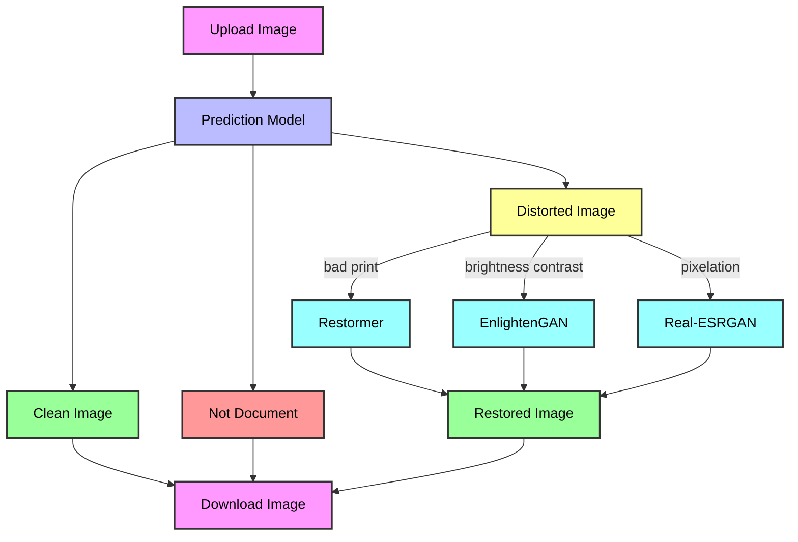

# Document Restoration Project

Проект по восстановлению изображений документов с использованием DL-моделей.

Классифицирует искажения (ResNet50) и применяет fine-tuned модели:
- Restormer — эффект "плохая печать"
- EnlightenGAN — эффект "плохой контраст"
- Real-ESRGAN — эффект "пикселизация"

Поддержка JPG/PNG, лог искажений, сервер с Gradio + Celery (многопоточность через Redis).

[](https://www.python.org/)
[](https://pytorch.org/)
[](https://gradio.app/)
[](https://opensource.org/licenses/MIT)

## Структура репозитория
- `notebooks/` — Ноутбуки (датасеты, fine-tune, тесты).
- `scripts/` — effects.py (искажения).
- `models/` — Веса моделей (скачайте по ссылкам).
- `data/` — Датасеты (скачайте по ссылкам).
- `metrics/` — Метрики обученных моделей.
- `assets/` — Тестовые изображения.
- `app.py` - py-файл для запуска приложения.

## Датасеты и веса (Google Drive)
- Датасеты: [папка](https://drive.google.com/drive/folders/1pl5iSfgUZSFefeuP-HYj85ORMpPojSX5?usp=sharing)
- Веса:
  - prediction_model.pth: [ссылка](https://drive.google.com/file/d/12aPG4dFQ_r64eg0e-yo1ak3yG4wYjU7H/view?usp=sharing)
  - finetuned_restormer.pth: [ссылка](https://drive.google.com/file/d/1QUgPn7qs0kHj8M8lmmgtIy44qVxvMy6a/view?usp=sharing)
  - finetuned_real_esrgan.pth: [ссылка](https://drive.google.com/file/d/1lgTLQ3K-q52WRmXmdLYb60kWdaJJjHvv/view?usp=sharing)
  - finetuned_enlightengan.pth: [ссылка](https://drive.google.com/file/d/1kkTi8dWub0jL7zA10B_0VDtEzGX0GpME/view?usp=sharing)


## Установка и запуск приложения (на Windows).
1. [Скачайте](https://github.com/redis/redis/releases) и установите Redis.

2. Зайдите в терминал и выполните:

```bash
git clone https://github.com/kudriavtcevroman/Document_Restoration_Project.git
cd Document_Restoration_Project

conda create -n doc_rest_app python=3.10 -y
conda activate doc_rest_app

git clone https://github.com/swz30/Restormer.git
git clone https://github.com/VITA-Group/EnlightenGAN.git
git clone https://github.com/xinntao/Real-ESRGAN.git

pip install -r requirements.txt
pip install "git+https://github.com/xinntao/BasicSR.git@8d56e3a045f9fb3e1d8872f92ee4a4f07f886b0a"

gdown https://drive.google.com/uc?id=12aPG4dFQ_r64eg0e-yo1ak3yG4wYjU7H -O prediction_model.pth
gdown https://drive.google.com/uc?id=1QUgPn7qs0kHj8M8lmmgtIy44qVxvMy6a -O finetuned_restormer.pth
gdown https://drive.google.com/uc?id=1lgTLQ3K-q52WRmXmdLYb60kWdaJJjHvv -O finetuned_real_esrgan.pth
gdown https://drive.google.com/uc?id=1kkTi8dWub0jL7zA10B_0VDtEzGX0GpME -O finetuned_enlightengan.pth
```

3. Выполните проверку:

```bash
python -c "import torch; print(torch.cuda.is_available())"
```

Если выдаст "False", то выполните:

```bash
pip uninstall torch torchvision torchaudio -y
pip install torch==2.3.1 torchvision==0.18.1 torchaudio==2.3.1 --index-url https://download.pytorch.org/whl/cu118
```

4. Откройте новый терминал и выполните:

```bash
cd C:\Program Files\Redis # Укажите путь к директории, куда установлен Redis

redis-server.exe
```

5. Откройте новый терминал и выполните:

```bash
cd Document_Restoration_Project

conda activate doc_rest_app

celery -A app.celery_app worker --loglevel=info --pool=solo # для многопоточного режима (celery -A app worker --loglevel=info --concurrency=2 --pool=threads)
```

6. Откройте новый терминал и выполните:

```bash
cd Document_Restoration_Project

conda activate doc_rest_app

python app.py
```

7. Откройте браузер и перейдите по адресу: http://127.0.0.1:7860


## Workflow обработки изображений в Document Restoration App



## Пример аугментации документа с эффектом плохой печати моделью Restormer


## Пример аугментации документа с плохим контрастом моделью EnlightenGAN


## Пример аугментации документа с плохим качеством моделью Real-ESRGAN

