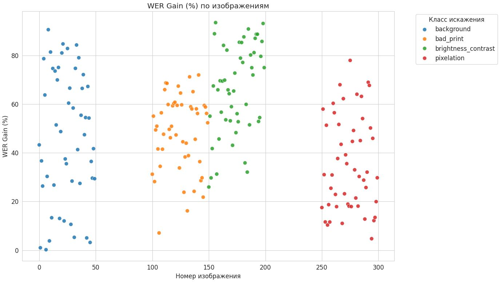
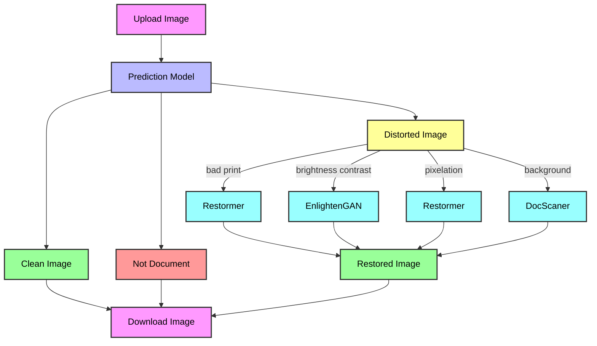
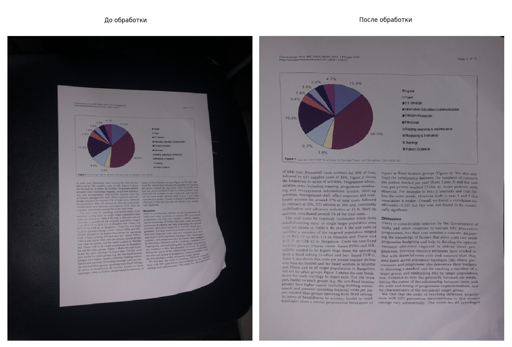

# Document Restoration Project

Проект по восстановлению изображений документов с использованием DL-моделей.

Классифицирует искажения (ResNet50) и применяет модели:
- Restormer — эффекты "плохая печать" и "пикселизация"
- EnlightenGAN — эффект "плохой контраст"
- DocScanner — эффект "посторонний фон"

Поддержка JPG/PNG, лог искажений, сервер с Gradio + Celery (многопоточность через Redis).

[](https://www.python.org/)
[](https://pytorch.org/)
[](https://gradio.app/)
[](https://opensource.org/licenses/MIT)

## Структура репозитория
- `notebooks/` — Ноутбуки (датасеты, fine-tune, тесты).
- `scripts/` — py-файлы.
- `models/` — Веса моделей (скачайте по ссылкам).
- `data/` — Датасеты (скачайте по ссылкам).
- `metrics/` — Метрики обученных моделей.
- `assets/` — Тестовые изображения.
- `app.py` - py-файл для запуска приложения.
- `requirements.txt` - файл с зависимостями, необходимыми для работы приложения.
 
## Датасеты и веса (Google Drive)
- Датасеты: [папка](https://drive.google.com/drive/folders/1pl5iSfgUZSFefeuP-HYj85ORMpPojSX5?usp=sharing)
- Веса:
  - prediction_model.pth: [ссылка](https://drive.google.com/file/d/17NFLGU17VIebNaf0vCJsW238JXkm9k8o/view?usp=sharing)
  - finetuned_restormer_bad_print.pth: [ссылка](https://drive.google.com/file/d/1QUgPn7qs0kHj8M8lmmgtIy44qVxvMy6a/view?usp=sharing)
  - finetuned_restormer_pixelation.pth: [ссылка](https://drive.google.com/file/d/1cHBAqs1PjuxxzKO4TS2c-C5p-zDSb3ae/view?usp=sharing)
  - finetuned_enlightengan.pth: [ссылка](https://drive.google.com/file/d/1kkTi8dWub0jL7zA10B_0VDtEzGX0GpME/view?usp=sharing)
  - DocScanner-L.pth: [ссылка](https://drive.google.com/file/d/1oEpjD1eSOAf_BPfRYqfZwfaR6ZtWOBU8/view?usp=sharing)
  - seg.pth (для DocScanner): [ссылка](https://drive.google.com/file/d/1Ik59a5iQ0stXZAxv6rsdjj4TB0Mxi3-p/view?usp=sharing)

## Бенчмарк `Document_Restoration_Benchmark`

Для объективной оценки качества восстановления документов был создан специализированный тестовый бенчмарк.

**Характеристики:**
- 300 изображений (по 50 на каждый из 6 классов)
- Каждое изображение имеет ground truth (чистое изображение)
- Разрешение: 1024 × 1448 (вертикальное A4)
- Используется для расчёта метрик PSNR, SSIM, CER, WER и gain-метрик

**Структура бенчмарка:**

```bash
Document_Restoration_Benchmark/
├── input/                  # Изображения с искажениями
│   ├── background/
│   ├── bad_print/
│   ├── brightness_contrast/
│   ├── clean/
│   ├── not_document/
│   └── pixelation/
├── gt/                     # Чистые изображения (ground truth)
│   ├── background/
│   ├── bad_print/
│   ├── brightness_contrast/
│   ├── clean/
│   ├── not_document/
│   └── pixelation/
└── labels.csv              # Разметка: image, true_distortion, gt_image
```

**Ссылка на бенчмарк:**  
[📁 Document_Restoration_Benchmark (Google Drive)](https://drive.google.com/drive/folders/1KAqG0XYx8lVp77myeWprDggVdXmVZc3h?usp=sharing)

**Результат тестирования Document Restoration App на бенчмарке:**

  
*График прироста метрики WER после восстановления по классам*

## Установка и запуск приложения (на Windows).
1. [Скачайте](https://github.com/redis/redis/releases) и установите Redis.
2. Установите Python 3.10:
   - Перейдите на страницу релиза Python 3.10:  https://www.python.org/downloads/release/python-31011/
   - Скачайте **Windows installer (64-bit)**.
   - Запустите установщик **от имени обычного пользователя**. **Обязательно** поставьте **«Add python.exe to PATH»** внизу окна.
   - Нажмите **Install Now**.
   - После установки откройте терминал  и проверьте:
```cmd
python --version
```

3. Запустите терминал и выполните:

```bash
mkdir C:\Projects
cd C:\Projects

git clone https://github.com/kudriavtcevroman/Document_Restoration_Project.git
cd Document_Restoration_Project

py -3.10 -m venv venv
venv\Scripts\activate

git clone https://github.com/swz30/Restormer.git
git clone https://github.com/VITA-Group/EnlightenGAN.git
git clone https://github.com/fh2019ustc/DocScanner.git DocScanner

pip install -r requirements.txt
pip install "git+https://github.com/xinntao/BasicSR.git@8d56e3a045f9fb3e1d8872f92ee4a4f07f886b0a"
```
[Скачайте веса моделей](https://github.com/redis/redis/releases](https://drive.google.com/drive/folders/1kZ-vAAXHmvOzeAnufvZec5wGHNj3hHkl)  и поместите в директорию C:\Projects\Document_Restoration_Project.

Выполните в том же терминале:
```bash
mkdir DocScanner\model_pretrained
move DocScanner-L.pth DocScanner\model_pretrained\DocScanner-L.pth
move seg.pth DocScanner\model_pretrained\seg.pth
```

4. Выполните проверку:

```bash
python -c "import torch; print(torch.cuda.is_available())"
```

Если выдаст "False", то выполните:

```bash
pip uninstall torch torchvision torchaudio -y
pip install torch==2.3.1 torchvision==0.18.1 torchaudio==2.3.1 --index-url https://download.pytorch.org/whl/cu118
```

5. Запустите новый терминал и выполните:

```bash
cd C:\Program Files\Redis # Укажите путь к директории, куда установлен Redis

redis-server.exe
```
Если выдаст " # Warning: no config file specified, using the default config. In order to specify a config file use redis-server.exe /path/to/redis.conf. # Creating Server TCP listening socket *:6379: bind: No such file or directory".
То выполните команду:
```bash
netstat -ano | findstr :6379
```
Должнен отобразиться список процессов (TCP    0.0.0.0:6379    ...    LISTENING    12345)

Убейте все процессы командой:
```bash
taskkill /PID 12345(ID процесса укажите свой) /F
```

6. Запустите новый терминал и выполните:

```bash
cd C:\Projects\Document_Restoration_Project

venv\Scripts\activate

celery -A app.celery_app worker --loglevel=info --pool=solo
```

7. Запустите новый терминал и выполните:

```bash
cd C:\Projects\Document_Restoration_Project

venv\Scripts\activate

python app.py
```

8. Откройте браузер и перейдите по адресу: http://127.0.0.1:7860


## Workflow обработки изображений в Document Restoration App


```mermaid
graph TD;
    A[Upload Image] --> B[Prediction Model];
    B --> C[Distorted Image];
    B --> D[Clean Image];
    B --> E[Not Document];
    C -->|bad print| F[Restormer];
    C -->|brightness contrast| G[EnlightenGAN];
    C -->|pixelation| H[Restormer];
    C -->|background| K[DocScaner];
    F --> I[Restored Image];
    G --> I[Restored Image];
    H --> I[Restored Image];
    K --> I[Restored Image];
    D --> J[Download Image];
    E --> J[Download Image];
    I --> J[Download Image];

    style A fill:#f9f,stroke:#333,color:#000,stroke-width:2px
    style B fill:#bbf,stroke:#333,color:#000,stroke-width:2px
    style C fill:#ff9,stroke:#333,color:#000,stroke-width:2px
    style D fill:#9f9,stroke:#333,color:#000,stroke-width:2px
    style E fill:#f99,stroke:#333,color:#000,stroke-width:2px
    style F fill:#9ff,stroke:#333,color:#000,stroke-width:2px
    style G fill:#9ff,stroke:#333,color:#000,stroke-width:2px
    style H fill:#9ff,stroke:#333,color:#000,stroke-width:2px
    style I fill:#9f9,stroke:#333,color:#000,stroke-width:2px
    style J fill:#f9f,stroke:#333,color:#000,stroke-width:2px
    style K fill:#9ff,stroke:#333,color:#000,stroke-width:2px
```

## Пример аугментации документа с эффектом плохой печати моделью Restormer_bad_print


## Пример аугментации документа с плохим контрастом моделью EnlightenGAN


## Пример аугментации документа с плохим качеством моделью Restormer_pixelation


## Пример аугментации документа с посторонним фоном моделью DocScaner

